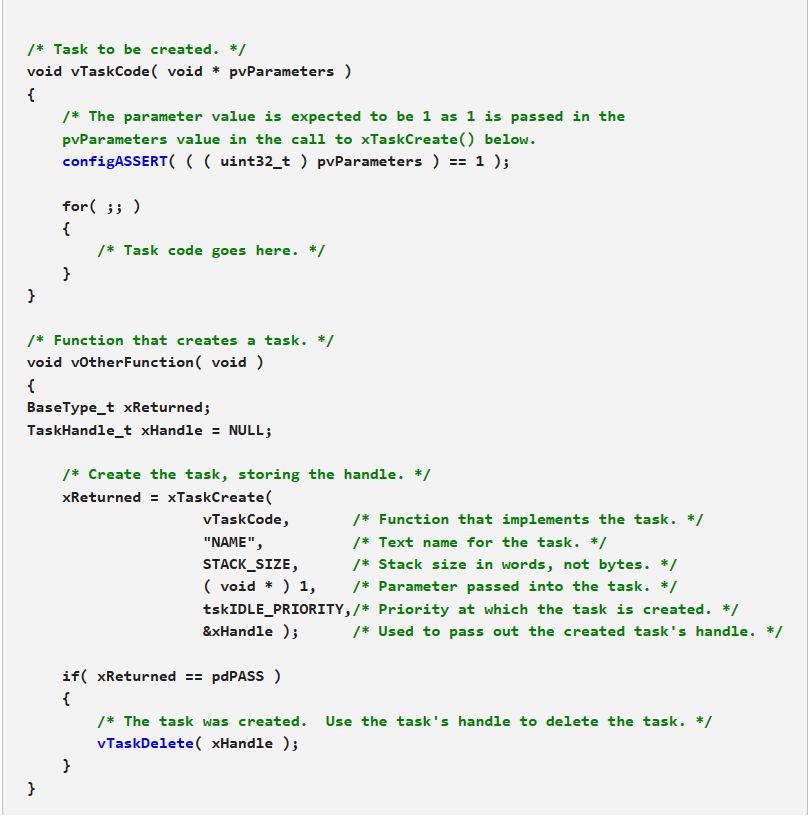

# FreeRTOS API

## xTaskCreate()

 BaseType_t **xTaskCreate**( TaskFunction_t **pvTaskCode**, const char * **const pcName**, configSTACK_DEPTH_TYPE **usStackDepth**, void ***pvParameters**, UBaseType_t **uxPriority**, TaskHandle_t ***pxCreatedTask** );

### Parameter

**pvTaskCode:** trỏ tới Task thực thi, các Task thường được thực hiện vô hạn, chức năng thực hiện của Task không thể quay lại hoặc thoát ra. Tuy nhiên các Task có thể tự xóa.

**pcName:** đây là tên của Task, thường dùng để gỡ lỗi cũng có thể sử dụng để có được một xử lý Task. Độ dài tối đa của tên Task được xác định bởi **configMAX_TASK_NAME_LEN**.

**usStackDepth:** số lượng từ (không phải byte) được phân bố để làm **task's stack**. Độ sâu ngăn xếp nhân với chiều rộng ngăn xếp không được vượt quá giá trị tối đa có thể chứa trong biến loại size_t.

**pvParameters:** 

**uxPriority:** thứ tự ưu tiên của Task khi Task được tạo. Các hệ thống bao gồm hỗ trợ MPU có thể tùy chọn tạo Task ở chế độ (hệ thống) đặc quyền bằng cách đặt bit portPRIVILEGE_BIT trong uxPriority. Ví dụ: để tạo một Task đặc quyền ở mức ưu tiên 2, hãy đặt uxPriority thành ( 2 | portPRIVILEGE_BIT ).Các hệ thống bao gồm hỗ trợ MPU có thể tùy chọn tạo Task ở chế độ (hệ thống) đặc quyền bằng cách đặt bit portPRIVILEGE_BIT trong uxPriority. Ví dụ: để tạo một Task đặc quyền ở mức ưu tiên 2, hãy đặt uxPriority thành ( 2 | portPRIVILEGE_BIT ).

Các ưu tiên được khẳng định là nhỏ hơn **configMAX_PRIORITIES**. Nếu **configASSERT** không được xác định, các ưu tiên sẽ được giới hạn âm ở (**configMAX_PRIORITIES - 1**).

**pxCreatedTask:** Được sử dụng để chuyển một điều khiển cho Task đã tạo ra khỏi hàm xTaskCreate(). pxCreatedTask là tùy chọn và có thể được đặt thành NULL.

