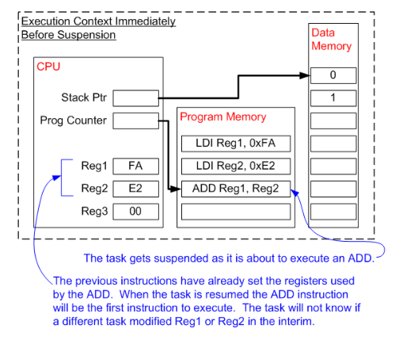

# RTOS Fundamental

## Multitasking

Kernel là thành phần cốt lõi trong một hệ điều hành. Các hệ điều hành như Linux sử dụng Kernels cho phép người dùng truy cập vào máy tính dường như đồng thời. Nhiều người dùng có thể thực hiện nhiều chương trình dường như đồng thời.

Mỗi chương trình thực thi là 1 Task (hoặc là một Thread) dưới sự kiểm soát của Hệ Điều Hành. Nếu một hệ điều hành thực thi được nhiều Task thì người ta gọi là đa nhiệm (**MultiTasking**)

Việc sử dụng một hệ điều hành đa nhiệm có thể đơn giản hóa thiết kế của một phần mềm phức tạp.
  * Multitasking và các liên lạc của inter-task cho phép biến các ứng dụng phức tạp thành các tác vụ nhỏ hơn, dễ quản lý hơn
  * Việc chia nhỏ sẽ giúp test phần mềm dễ dàng hơn, chia nhỏ công việc trong nhóm và tái sử dụng code
  * Các timing phức tạp, những chi tiết liên tục có thể đưa ra khỏi code của ứng dụng và trở thành nhiệm vụ của của hệ điều hành

### Multitasking và Concurrency

Một bộ xử lý thông thường chỉ có thể thực hiện được một Task trong một thời điểm cụ thể - nhưng mà bằng cách chuyển đổi nhanh chóng giữa các Task, một hệ điều hành có thể làm cho chúng xuất hiện như đang thực thi đồng thời.

## Scheduling

Scheduler là một phần của Kernel chịu trách nhiệm quyết định tác vụ nào sẽ được thực thi tại bất kì thời điểm cụ thể nào. Kernel có thể Suspend và Resume một tác vụ nhiều lần trong suốt quãng thời gian tác vụ đó tồn tại

Chính sách scheduling là thuật toán được scheduler sử dụng để quyết định xem Task nào sẽ được thực hiện ở thời điểm nào. Chính sách của non-realtime sẽ cho phép mỗi task có tỷ lệ công bằng về thời gian của bộ xử lý.

Ngoài việc bị Kernel Suspend một cách không tự nguyện thì một Task còn có thể tự Suspend. Nó sẽ thực hiện điều này nếu nó muốn delay (sleep) trong một khoảng thời gian cố định, hoặc chờ để tài nguyên sẵn sàng hoặc một sự kiện xảy ra. Các tác vụ bị chặn hoặc đang ngủ không thể thực thi và sẽ không được phân bố thời gian xử lý.

* Tại (1) thì Task1 đang thực thi
* Tại (2) thì Kernel sẽ Suspend Task1
* Tại (3) thì Task2 Resume
* Trong khi Task2 đang được thực thi (4), nó khóa một thiết bị ngoại vi của bộ xử lý để có độc quyền riêng của nó
* Tại (5) Kernel Suspend Task2
* Tại (6) Resume Task3.
* Task3 cố gắng truy cập cùng một thiết bị ngoại vi của bộ vi xử lý (7), thấy được vi xử lý bị khóa nên Task3 bị Suspend.
* Tại (8) Kernel Resume Task1
  

## Context Switching

Khi mà một Task thực thi nó sử dụng bộ xử lý / các thanh ghi của vi điều khiển và truy cập vào RAM, ROM giống như bất kì chương trình nào khác. Các tài nguyên này (thanh ghi, stack,...) tạo nên **ngữ cảnh** thực thi tác vụ

