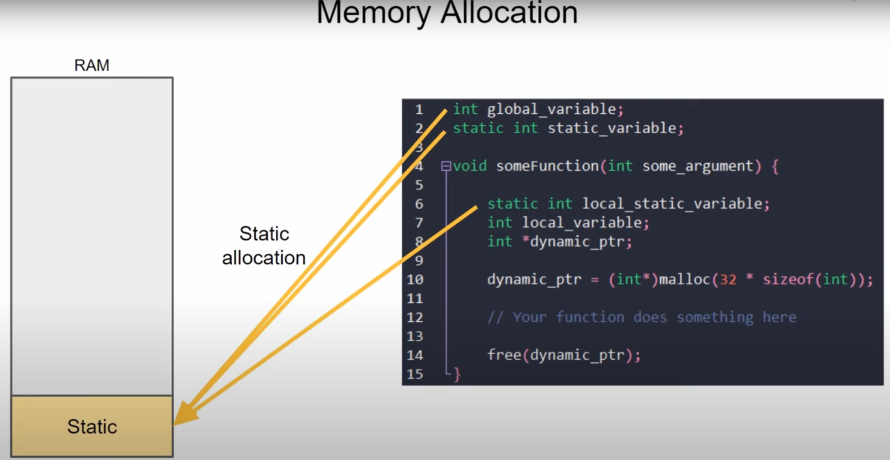
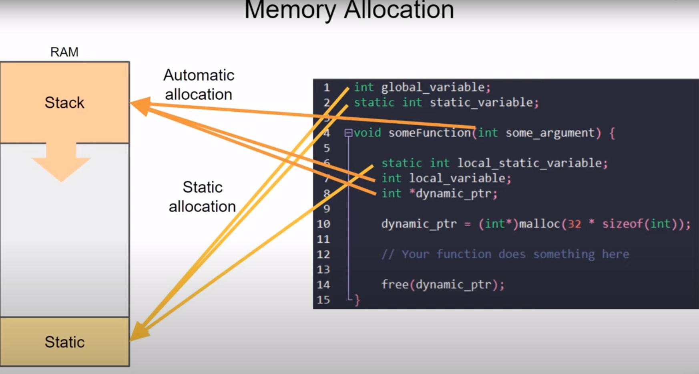
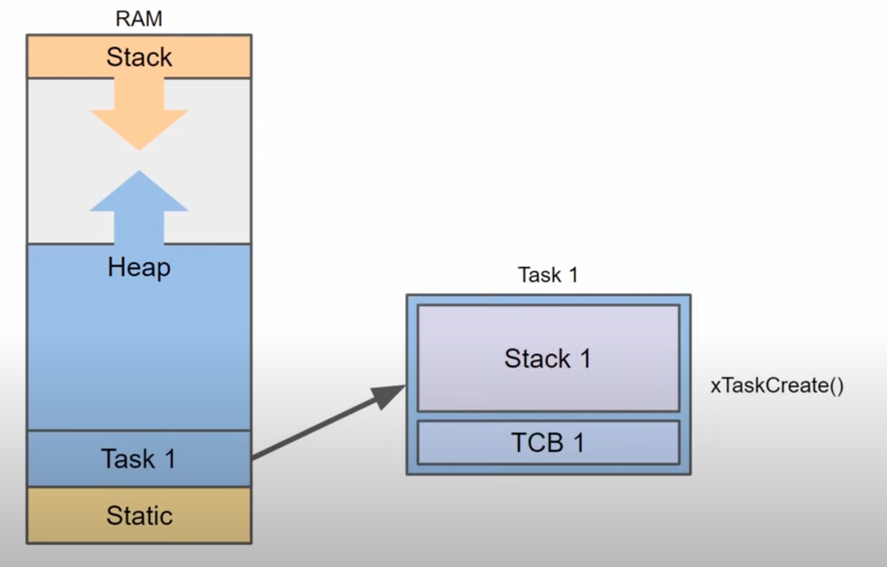
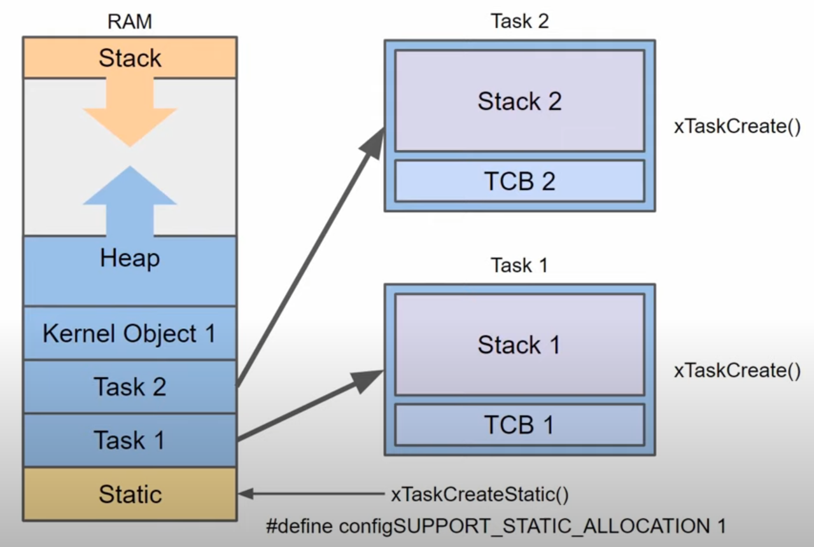

# MEMORY MANAGEMENT

## STATIC 

Compiler sẽ biết cần bao nhiêu bộ nhớ cho các biến toàn cục và biến tĩnh khi nó biên dịch xong chương trình của bạn. Kết quả là sau khi chương trình của bạn bắt đầu chạy, một phần bộ nhớ sẽ được phân bổ cho chỉ những biến đó. Phần này được gọi là ***Static*** và không thể được sử dụng cho các phần khác của chương trình. Tất cả những biến global hoặc các biến tĩnh mà bạn khai báo sẽ được lưu trữ trong phần bộ nhớ này, đây gọi là **cấp phát tĩnh**. Các biến này tồn tại trong toàn bộ thời lượng của chương trình.

## STACK

Bên trong hàm gọi các biến cục bộ (local), các biến này được đẩy vào STACK - lưu ý rằng STACK là hệ thống LIFO. Điều này giúp dễ dàng liên tục đẩy các biến vào vào STACK khi gọi các hàm lồng nhau
Khi quay trở lại các biến của hàm gọi có thể bật ra khỏi ngăn xếp như một phần của quá trình trả về dữ liệu hoặc bộ nhớ bị xóa hoàn toàn hoặc bị hủy cấp phát khi một hàm trả về, trong khi đó trình biên dịch sẽ dự trữ nhiều STACK mà nó cho là cần thiết cho các biến cục bộ, ngăn xếp có thể tăng kích thước tự động, phân bổ những gì cần thiết từ bộ nhớ trống. Bạn sẽ thường thấy điều này xảy ra với các hàm đệ quy, các đối số của biến local và các con trỏ local được lưu trữ trong STACK. Đây được gọi là **cấp phát tự động** 

## HEAP

Giống như STACK thì HEAP có thể mở rộng trong quá trình thực hiện chương trình và nó thường phát triển về hướng của STACK.
*Tùy vào bộ xử lý và Compiler mà vị trí của STACK và STATIC có thể hoán đổi cho nhau. Check kĩ datasheet để chắc chắn việc phân bổ bộ nhớ mà thiết bị bạn đang sử dụng.*

HEAP được sử dụng khi mà lập trình viên thông báo rõ ràng cho bộ nhớ, tạo dung lượng cho những gì bạn sắp lưu trữ. Thông thường bạn sẽ thực hiện việc này với một số chức năng như malloc.

*Lưu ý rằng trong C và C++ thì bạn được yêu cầu giải phóng bất kì bộ nhớ nào mà bạn đã cấp phát khi bạn sử dụng xong.* Nếu bạn quên việc giải phóng sau khi thực hiện chương trình xong thì bạn có thể khiến HEAP tiếp tục phát triển vô thời hạn - rò rỉ bộ nhớ, khiến chúng ta khó theo dõi, và thậm chí HEAP và STACK sẽ ghi đè lên bộ nhớ của nhau gây ra nhiều lỗi không xác định.

## RTOS MEMORY ALLOCATION

Khi bạn tạo một Task, thì Task đó được gán một phần bộ nhớ từ HEAP

Phần bộ nhớ của Task sẽ được chia thành một khối điều khiển hoặc một khối TCB và một stack duy nhất cho nhiệm vụ đó. 
***TCB:*** TCB là một cấu trúc lưu giữ thông tin quan trọng về nhiệm vụ chẳng hạn như: vị trí của Stack của Task, mức độ ưu tiên của Task.

Khi chúng ta call hàm xTaskCreate() hoặc hàm xTaskPintoCore() thì chúng ta phải báo cho hệ điều hành biết chúng ta cần bao nhiêu phân vùng bộ nhớ trong HEAP để hoạt động như một STACK của Task. Nếu chúng ta không cấp đầy đủ bộ nhớ thì có thể chúng ta sẽ vô tình ghi đè lên các phần bộ nhớ khác gây ra những lỗi không xác định thậm chí đặt lại cả bộ vi xử lý.

Mỗi Task chúng ta tạo sẽ tự động đặt một vùng bộ nhớ bao gồm một TCB mới và một Stack bên trong HEAP. Khi chúng ta nhắc đến Queue hay Semaphores thì chúng cũng sẽ được tạo trong HEAP

