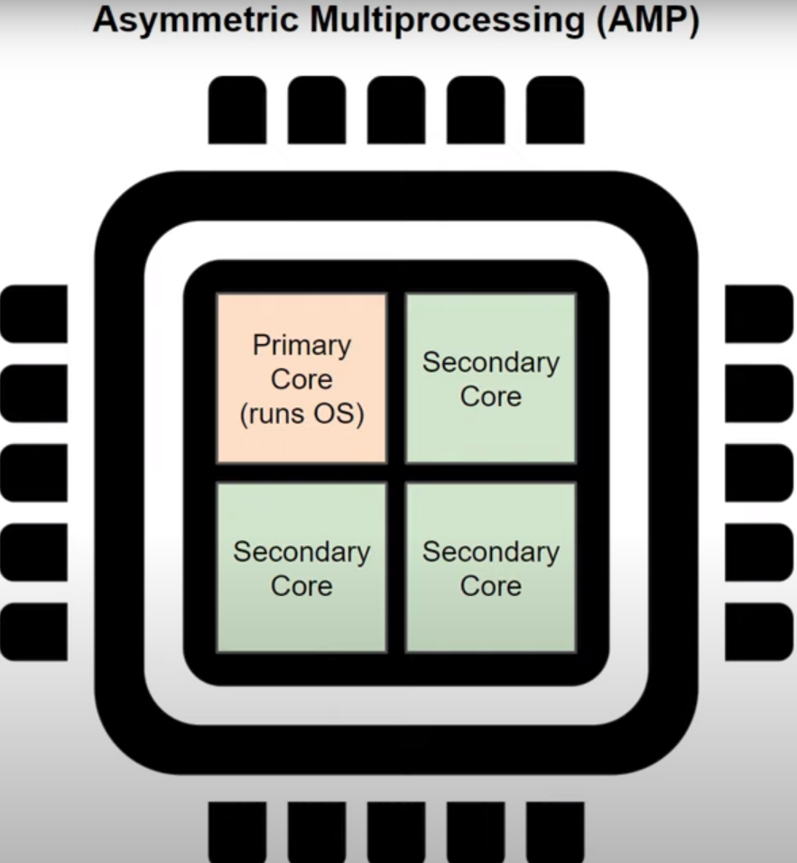
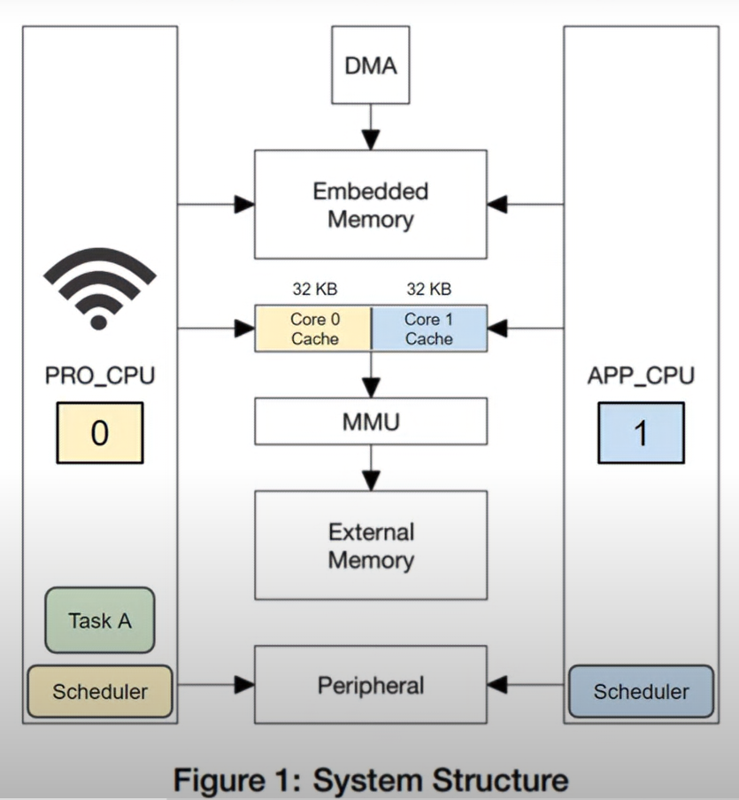

# Multicore System

## AMP & SMP

### AMP là gì?
AMP là viết tắt của Asymmestric Multiprocessing (AMP) hay còn gọi là đa xử lý bất đối xứng. AMP xuất hiện trước SMP.
Với AMP bạn cần hai hoặc nhiều bộ xử lý hoặc core để giao tiếp với nhau. 
Một lõi chịu trách nhiệm chạy hệ điều hành và gửi các tác vụ hoặc công việc đến các lõi khác. Lưu ý rằng các lõi phụ có thể có hệ điều hành riêng và chạy các Task. Nhưng AMP yêu cầu một lõi gửi các tác vụ

### SMP là gì?
SMP là viết tắt của Symmetric Multiprocessing hay còn gọi là đa xử lý đối xứng .
Trong SMP mỗi lõi hoặc bộ xử lý được đối xử bình đẳng và chạy trên cùng một hệ điều hành.
Các Task có thể truy cập bởi tất cả các core cà mỗi core có thể lấy từ cái danh sách công việc đó để mà biết được nó cần làm gì.
Bạn có thể tùy chọn các core cũng như là cấu hình của nó giống hoặc khác nhau cho các core với bộ khuếch đại 

## Core trong ESP32

ESP32 có 2 core: một là protocol core, 2 là app core

protocol core: được gán nhãn là cpu0
app core: được gán nhãn là cpu1

Cả 2 lõi đều có cùng một kiến trúc là extensa lx6 và dùng chung mội bus mà chúng sử dụng để truy cập vào bộ nhớ và các thiết bị ngoại vi. 

Mặc dù có vẻ như bộ đệm được chia sẻ với nhau nhưng thực tế không phải vậy. Trong kiến trúc multicore, mỗi core có một bộ nhớ đệm riêng. Trong ESP32 64 kB đầu tiên của RAM được chỉ thị đặt riêng sang 1 bên để làm bộ nhớ cache: 32kB là bộ đệm cho core 0 và 32kB còn lại là bộ đệm cho core 1.

Protocol Core: là core dùng để chạy các Task cho các protocol khác nhau như wi-fi và bluetooth. Ý định là để người dùng chạy chương trình của họ trong App Core tách biệt với những Stack về protocol ở Pro Core.

Mỗi lõi có một Scheduler riêng cũng như có Timer riêng. Điều đó có nghĩa là chúng ta có nghĩa là chúng ta không thể cho rằng các Task trên core0 sẽ thực thi cùng lúc và đồng bộ với các Task ở trên core1.

Task control Block, Stack và code tồn tại trong bộ nhớ dùng chung, điều đó có nghĩa là một trong hai core có thể cạu bất kỳ tác vụ cụ thể nào. ESP-IDF có hỗ trợ để cho phép Scheduler ở một trong hai core chọn Task có mức độ ưu tiên cao nhất ở trang thái READY ở trạng thái dùng chung. Chúng ta còn có thể liệt kê hoặc Pin một Task vào core khi tạo chúng. Nếu chúng ta Pin một Task vào core thì chúng ta đang nói với Task đó rằng nó phải luôn chạy trong một core cụ thể.

