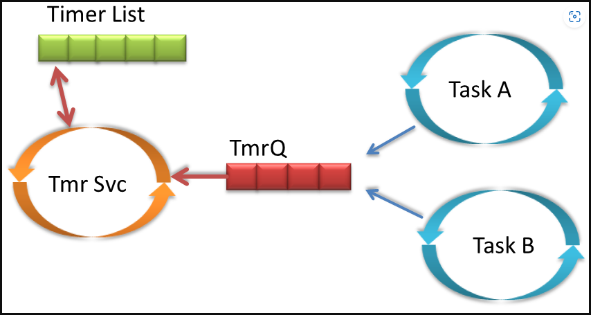
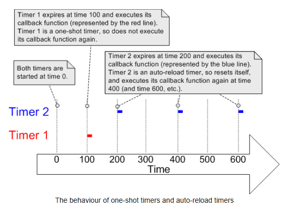
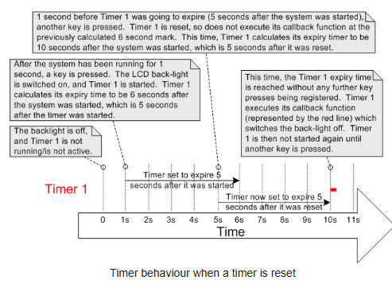

# SOFTWARE TIMER

## Timer Service/Daemon Task and The Timer Command Queue

Chức năng Timer là tùy chọn và không phải là một phần của FREERTOS. Timer thường được tạo ra bởi các task Timer Service ( daemon ).

FreeRTOS cung cấp một tập hợp các API timer. Rẩt nhiều chức năng trong đó sử dụng queue cơ bản của FreeRTOS để gửi lệnh đến Timer service task.  "Timer command queue" chỉ được sử dụng cho timer FreeRTOS thực hiện nên chúng ta không thể tác động trực tiếp vào.



Nhìn vào sơ đồ bên dưới. Đoạn code ở bên trái là một chương trình ứng dụng của người dùng. Đoạn code bên phải là chương trình thực thi của timer service task. Thì lúc này timer command queue sẽ kết nối giữa task ứng dụng và timer service task. Trong ví dụ này, xTimerReset() được gọi từ code. Điều này dẫn đến một lệnh đặt lại được gửi đến timer command queue để timer service task xử lý. Code chỉ gọi hàm API xTimerReset() - nó không (và không thể) truy cập trực tiếp vào hàng đợi lệnh hẹn giờ. 


## Timer Daemon Configuration

Cách để cấu hình để có thể sử dụng software timers

Để có thể sử dụng những API của software timer chỉ cần:

1. Thêm source file FreeRTOS/Source/timers.c vào project của bạn, và
2. Xác định các hằng số trong bảng bên dưới trong header file FreeRTOSConfig.h

| Constant | Description |
|:---------:|:------------|
| configUSE_TIMERS | - Set thành 1 để thêm timer vào project của mình. Timer service task sẽ tự động được khởi tạo khi scheduler bắt đầu. Nếu bạn không sử dụng bộ hẹn giờ phần mềm FreeRTOS, hãy đặt macro đó thành 0, nếu không, ứng dụng của bạn đang sử dụng nhiều tài nguyên hơn mức cần thiết. Bởi vì điều này tạo ra Timer Service Task trong vTaskStartScheduler() |
| configTIMER_TASK_PRIORITY | Macro này dùng để set mức độ ưu tiên của Timer Service Task. Giống như tất cả các task, Timer Service Task có thể chạy ở bất kì mức độ ưu tiên nào từ 0 đến ( configMAX_PRIORITIES - 1 ).*Giá trị này cần phải được lựa chọn cẩn thận để đáp ứng yêu cầu của ứng dụng. Ví dụ: nếu Timer Service Task đặt làm nhiệm vụ có mức ưu tiên cao nhất trong hệ thống, thì các lệnh được gửi đến Timer Service Task (khi hàm API timer được gọi) và cả hai timer đã hết hạn sẽ được xử lý ngay lập tức. Ngược lại, nếu Timer Service Task có mức độ ưu tiên thấp thì các lệnh được gửi đến Timer Service Task và các timer hết hạn sẽ không được xử lý cho đến khi Timer Service Task là tác vụ có mức ưu tiên cao nhất có thể chạy. Tuy nhiên, điều đáng chú ý ở đây là thời gian hết hạn của bộ đếm thời gian được tính tương ứng với thời điểm lệnh được gửi chứ không liên quan đến thời điểm lệnh được xử lý.*|
| configTIMER_QUEUE_LENGTH | Macro này set số lượng tối đa các lệnh chưa được xử lý mà Timer Command Queue có thể giữ bất kì lúc nào |
| configTIMER_TASK_STACK_DEPTH | Set kích thước của stack ( bằng chữ, không phải byte ). Timer callback function thực thi trong ngữ cảnh của Timer Service Task. Do đó, yêu cầu stack của Timer Service Task phụ thuộc vào yêu cầu ngăn xếp của các chức năng Timer callback | 

Ví dụ:
```C
#define configUSE_TIMERS 1
#define configTIMER_SERVICE_TASK_NAME "Tmr Svc"
#define configTIMER_TASK_PRIORITY (configMAX_PRIORITIES - 1)
#define configTIMER_QUEUE_LENGTH 10
#define configTIMER_TASK_STACK_DEPTH (configMINIMAL_STACK_SIZE * 2)
```
**Những lý do khiến timer command queue có thể đầy bao gồm:**
* Thực hiện nhiều lệnh gọi hàm API timer trước khi Scheduler RTOS được khởi động và do đó trước khi Timer Service Task được tạo.
* Thực hiện nhiều lệnh gọi các API ( Interrupt safe ) từ interrupt service routine (ISR).
* Thực hiện nhiều lệnh gọi các API từ một task có mức độ ưu tiên cao hơn Timer Service Task.


## One-shot timers vs Auto-reload timers

Có 2 loại timer đó là One-shot timers và Auto-reload timers 
* One-shot timers: Nó chỉ callback duy nhất một lần, khi thực hiện xong thì sẽ không chạy lại lần nữa. Chúng ta vẫn có thể khởi động lại timer bằng cách thủ công chứ nó không thể tự khởi động lại.
* Auto-reload: Sau khi khởi động, tỉmer sẽ tự động reload sau mỗi lần được callback, điều này tạo ra sự định kì lặp đi lặp lại.

Sự khác nhau về cách hoạt động của One-shot timers và Auto-reload timers được biểu hiện ở hình dưới. Trong hình, Timer 1 là One-shot tỉmer có chu kì là 100, và Timer 2 là Auto-reload timer với chu kì là 200.



## Resetting a software timer

Chúng ta có thể reset timer, cái mà đã được chạy từ trước. Việc reset timer dẫn đến việc timer sẽ tính toán lại thời gian hết hạn để tở nên tương ứng với thời điểm timer được đặt lại chứ không phải khi timer được bắt đầu lúc ban đầu.

Trong ví dụ được mô tả, giả định rằng ứng dụng sẽ bật đèn nền LCD khi nhấn một phím và đèn nền vẫn sáng cho đến khi 5 giây trôi qua mà không nhấn bất kỳ phím nào. Timer 1 được sử dụng để tắt đèn nền LCD khi hết 5 giây.



## Ví dụ 

Create a Software Timer

```C
#define configUSE_TIMERS 1
#define configTIMER_SERVICE_TASK_NAME "Tmr Svc"
#define configTIMER_TASK_PRIORITY (configMAX_PRIORITIES - 1)
#define configTIMER_QUEUE_LENGTH 10
#define configTIMER_TASK_STACK_DEPTH (configMINIMAL_STACK_SIZE * 2)

xTimerHandle timerHndl1Sec;

TimerHandle_t xTimerCreate( 
    const char * const pcTimerName, 
    const TickType_t xTimerPeriodInTicks,
    const UBaseType_t uxAutoReload,
    void * const pvTimerID,
    TimerCallbackFunction_t pxCallbackFunction )

// TIMER CALLBACK
static void vTimerCallback1SecExpired(xTimerHandle pxTimer) 
{
    GPIO_PortToggle(BOARD_INITPINS_LED_RED_GPIO, 1<<BOARD_INITPINS_LED_RED_PIN); 
    /* toggle red LED */
}

void app_main()
{
    // CREATE A NEW TIMER:
    timerHndl1Sec = xTimerCreate(
      "timer1Sec",                      /* name */
      pdMS_TO_TICKS(1000),              /* period/time */
      pdTRUE,                           /* auto reload */
      (void*)0,                         /* timer ID */
      vTimerCallback1SecExpired);       /* callback */
    if (timerHndl1Sec==NULL) 
    {
        for(   ;    ;   );              /* failure! */
    }

    // STARTING A TIMER
    BaseType_t xTimerStart( TimerHandle_t xTimer, TickType_t xTicksToWait );
}
```

### MORE AND MORE DETAIL

