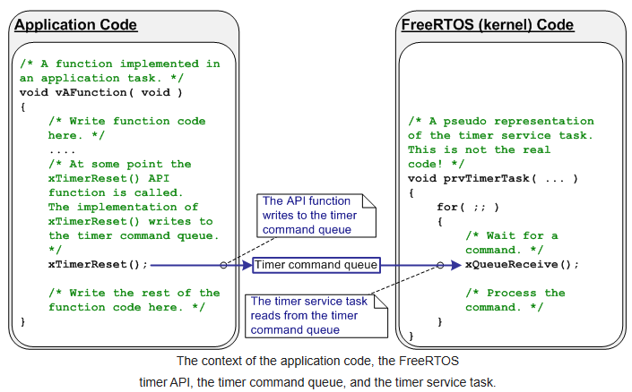

# SOFTWARE TIMER

## I. Timer Service/Daemon Task and The Timer Command Queue

Chức năng Timer là tùy chọn và không phải là một phần của FREERTOS. Timer thường được tạo ra bởi các task Timer Service ( daemon ).

FreeRTOS cung cấp một tập hợp các API timer. Rẩt nhiều chức năng trong đó sử dụng queue cơ bản của FreeRTOS để gửi lệnh đến Timer service task.  "Timer command queue" chỉ được sử dụng cho timer FreeRTOS thực hiện nên chúng ta không thể tác động trực tiếp vào.


Nhìn vào sơ đồ bên dưới. Đoạn code ở bên trái là một chương trình ứng dụng của người dùng. Đoạn code bên phải là chương trình thực thi của timer service task. Thì lúc này timer command queue sẽ kết nối giữa task ứng dụng và timer service task. Trong ví dụ này, xTimerReset() được gọi từ code. Điều này dẫn đến một lệnh đặt lại được gửi đến timer command queue để timer service task xử lý. Code chỉ gọi hàm API xTimerReset() - nó không (và không thể) truy cập trực tiếp vào hàng đợi lệnh hẹn giờ. 



## II. Timer Daemon Configuration

Cách để cấu hình để có thể sử dụng software timers

Để có thể sử dụng những API của software timer chỉ cần:

1. Thêm source file FreeRTOS/Source/timers.c vào project của bạn, và
2. Xác định các hằng số trong bảng bên dưới trong header file FreeRTOSConfig.h

| Constant | Description |
|:---------:|:------------|
| configUSE_TIMERS | - Set thành 1 để thêm timer vào project của mình. Timer service task sẽ tự động được khởi tạo khi scheduler bắt đầu. Nếu bạn không sử dụng bộ hẹn giờ phần mềm FreeRTOS, hãy đặt macro đó thành 0, nếu không, ứng dụng của bạn đang sử dụng nhiều tài nguyên hơn mức cần thiết. Bởi vì điều này tạo ra Timer Service Task trong vTaskStartScheduler() |
| configTIMER_TASK_PRIORITY | Macro này dùng để set mức độ ưu tiên của Timer Service Task. Giống như tất cả các task, Timer Service Task có thể chạy ở bất kì mức độ ưu tiên nào từ 0 đến ( configMAX_PRIORITIES - 1 ).*Giá trị này cần phải được lựa chọn cẩn thận để đáp ứng yêu cầu của ứng dụng. Ví dụ: nếu Timer Service Task đặt làm nhiệm vụ có mức ưu tiên cao nhất trong hệ thống, thì các lệnh được gửi đến Timer Service Task (khi hàm API timer được gọi) và cả hai timer đã hết hạn sẽ được xử lý ngay lập tức. Ngược lại, nếu Timer Service Task có mức độ ưu tiên thấp thì các lệnh được gửi đến Timer Service Task và các timer hết hạn sẽ không được xử lý cho đến khi Timer Service Task là tác vụ có mức ưu tiên cao nhất có thể chạy. Tuy nhiên, điều đáng chú ý ở đây là thời gian hết hạn của bộ đếm thời gian được tính tương ứng với thời điểm lệnh được gửi chứ không liên quan đến thời điểm lệnh được xử lý.*|
| configTIMER_QUEUE_LENGTH | Macro này set số lượng tối đa các lệnh chưa được xử lý mà Timer Command Queue có thể giữ bất kì lúc nào |
| configTIMER_TASK_STACK_DEPTH | Set kích thước của stack ( bằng chữ, không phải byte ). Timer callback function thực thi trong ngữ cảnh của Timer Service Task. Do đó, yêu cầu stack của Timer Service Task phụ thuộc vào yêu cầu ngăn xếp của các chức năng Timer callback | 

Ví dụ:
```C
#define configUSE_TIMERS 1
#define configTIMER_SERVICE_TASK_NAME "Tmr Svc"
#define configTIMER_TASK_PRIORITY (configMAX_PRIORITIES - 1)
#define configTIMER_QUEUE_LENGTH 10
#define configTIMER_TASK_STACK_DEPTH (configMINIMAL_STACK_SIZE * 2)
```
**Những lý do khiến timer command queue có thể đầy bao gồm:**
* Thực hiện nhiều lệnh gọi hàm API timer trước khi Scheduler RTOS được khởi động và do đó trước khi Timer Service Task được tạo.
* Thực hiện nhiều lệnh gọi các API ( Interrupt safe ) từ interrupt service routine (ISR).
* Thực hiện nhiều lệnh gọi các API từ một task có mức độ ưu tiên cao hơn Timer Service Task.


## III. Thuộc tính và trạng thái của Software Timer


### One-shot and Auto-reload Timers
Có 2 loại timer đó là One-shot timers và Auto-reload timers 
* One-shot timers: Nó chỉ callback duy nhất một lần, khi thực hiện xong thì sẽ không chạy lại lần nữa. Chúng ta vẫn có thể khởi động lại timer bằng cách thủ công chứ nó không thể tự khởi động lại.
* Auto-reload: Sau khi khởi động, tỉmer sẽ tự động reload sau mỗi lần được callback, điều này tạo ra sự định kì lặp đi lặp lại.

Sự khác nhau về cách hoạt động của One-shot timers và Auto-reload timers được biểu hiện ở hình dưới. Trong hình, Timer 1 là One-shot tỉmer có chu kì là 100, và Timer 2 là Auto-reload timer với chu kì là 200.


* Timer 1: One-shot timer với chu kì là 6 ticks. Nó được bắt đầu ở t1 nên sau 6 ticks thì nó sẽ được call back ở t7. Vì là One-shot timer nên callback function của nó không thực hiện lại.
* Timer 2: Auto-reload timer với chu kì là 5 ticks. Nó được bắt đầu ở t1 nên sau 5 ticks thì callback function sẽ được gọi lại sau mỗi 5 ticks.

### Trạng thái của Software Timer 
Software timer có thể chia làm 2 trạng thái: 
* Dormant (ngủ đông): Software timer tồn tại và có thể tham chiếu bằng handle của nó nhưng nó không chạy do đó các callback function của nó sẽ không thực thi
* Running: Software timer đang trong trạng thái Running sẽ thực thi callback function của nó sau một khoảng thời gian của nó kể từ khi Software Timer chuyển sang trạng thái Running hoặc kể từ khi Software Timer được Reset.


Hình 39 và hình 40 cho chúng ta thấy cách chuyển đổi giữa các trạng thái Dormant vs Running cho One-shot timer mà auto-reload timer tương ứng. Khi chúng ta tạo một Task thì ngay lập tức task đó vào trạng thái Dormant. Và cách để đưa nó vào từng trạng thái thì ta có thể nhìn hình.

## IV. Daemon Task Scheduling
Daemon Task được schedule giống như mọi task khác; chúng sẽ chỉ xử lý các lệnh hoặc thực thi timer callback functions. Khi đó task có mức ưu tiên cao nhất sẽ được chạy. 


**Ví dụ 1**


Hình 42 là hình thể hiện việc các task chạy khi mà Daemon Task có mức độ ưu tiên thấp hơn mức độ ưu tiên của task gọi hàm API xTimerStart().
Nhìn hình 42, trong đó mức độ ưu tiên của Task 1 lớn hơn mức độ ưu tiên của Daemon Task và mức độ ưu tiên của Ilde Task là thấp nhất.
1. Tại t1: 
* Task 1 đang trong trạng thái Running còn Daemon Task đang trong trạng thái Block.

*  Daemon Task sẽ thoát khỏi trạng thái Block nếu một lệnh được gửi đến timer command queue, trong trường hợp đó nó sẽ xử lý lệnh đó. Hoặc nếu software timer hết hạn thì nó sẽ thực hiện callback function của software timer.

2. Tại t2: 
* Task 1 call xTimerStart().
* xTimerStart() gửi một lệnh cho timer commmand queue làm cho Daemon Task thoát khỏi trạng thái Block. Mức độ ưu tiên của Task 1 cao hơn mức độ ưu tiên của Daemon Task vì vậy Daemon Task không được thực hiện trước Task 1.
* Task 1 vẫn ở trạng thái Running còn Daemon Task đã thoát khỏi trạng thái Block và nằm trong trạng thái Ready.

3. Tại t3:
*  Task 1 hoàn thành việc thực thi hàm API xTimerStart() từ đầu đến cuối mà không thoát khỏi trạng thái Running.

4. Tại t4:
* Task 1 call API đưa nó vào trạng thái Block. Lúc này Daemon Task là task có mức độ ưu tiên cao nhất trong hàng Ready, do đó Scheduler đưa Daemon Task vào trạng thái Running. Daemon Task lúc này bắt đầu xử lý lệnh mà Task 1 gửi vào timer command queue.

* **Lưu ý: Thời gian mà software timer đang được khởi động sẽ hết hạn được tính từ: thời điểm lệnh "start a timer" được gửi đến timer command queue - nó không được tính từ thời điểm tác vụ daemon nhận được lệnh "start a timer" từ timer command queue.**

5. Tại t5:
* Daemon Task đã hoàn tất việc xử lý lệnh do Task 1 gửi tới nó và cố gắng nhận thêm dữ liệu từ timer command queue. Timer command queue lúc này trống, do đó Daemon Task sẽ chuyển sang trạng thái Block. Daemon Task sẽ lại thoát khỏi trạng thái Block nếu lệnh gửi đến timer command queue, hoặc software timer hết hạn. 
* Idle Task lúc này là task có mức độ ưu tiên cao nhất trong những task đang Ready, do đó scheduler kéo Idle Task vào trạng thái Running.

**Ví dụ 2**


Nhìn hình 43, trong đó mức độ ưu tiên của Task 1 nhỏ hơn mức độ ưu tiên của Daemon Task và mức độ ưu tiên của Ilde Task là thấp nhất.

1. Tại t1:
* Trước đó, Task 1 đang trong trạng thái Running còn, Daemon Task thì đang nằm trong trạng thái Block

2. Tại t2: 
* Task 1 calls xTimerStart(). 
* xTimerStart() gửi lệnh vào timer command queue để đưa Daemon Task ra khỏi trạng thái bị Block. Mức độ ưu tiên của Daemon Task lớn hơn mức độ ưu tiên của Task 1 cho nên scheduler đưa Daemon Task vào trạng thái Running. Trong khi đó, Task 1 đã bị Daemon Task chiếm quyền thực thi khi mà chưa hoàn thành việc thực thi hàm xTimerStart() và đang được đưa vào Ready.
* Daemon Task lúc này bắt đầu xử lý lệnh mà Task 1 gửi vào timer command queue.

3. Tại t3:
* Daemon Task đã hoàn tất việc xử lý lệnh do Task 1 gửi tới nó và cố gắng nhận thêm dữ liệu từ timer command queue. Timer command queue lúc này trống, do đó Daemon Task sẽ chuyển sang trạng thái Block. Daemon Task sẽ lại thoát khỏi trạng thái Block nếu lệnh gửi đến timer command queue, hoặc software timer hết hạn. 

4. Tại t4 và t5: tương tự như ở vd1.

## V. Creating and Starting a Software Timer

**xTimeCreate()**

## VI. Thay đổi chu kì của Timer

Muốn thay đổi chu kì của software timer thì ta sử dụng chương trình xTimerChangePeriod().
* *Nếu xTimerChangePeriod() được sử dụng để thay đổi chu kì của timer đang chạy thì bộ timer sẽ sử dụng giá trị chu kì mới để tính toán lại thời gian hết hạn. Thời gian hết hạn được tính toán lại dựa theo thời điểm xTimerChangePeriod() được gọi, không liên quan đến lúc mà timer khởi chạy.*
* *Nếu xTimerChangePeriod() được dùng để thay đổi chu kì của timer đang trong trạng thái Dormant thì timer sẽ tính toán lại thời gian hết hạn và chuyển sang trạng thái Running.*

**Lưu ý: Không bao giờ gọi hàm xTimerChangePeriod() từ ngắt, thay vào đó ta nên sử dụng xTimerChangePeriodFromISR()**


| Param/ Returned Value | Description |
| :-------------------: | :--------- |
| xTimer | Là một biến/địa chỉ giúp ta handle được giá trị chu kì mới mà ta muốn thêm vào. Biến/địa chỉ này được trả về từ việc chúng ta xTimerCreate() tạo một software timer |
| xTimerPeriodInTicks | Chu kì mới của software timer, được xác định bằng các ticks. Macro pdMS_TO_TICKS() có thể được dùng để chuyển đổi thời gian từ milliseconds về ticks. |
| xTicksToWait | xTimerChangePeriod() sử dụng timer command queue để gửi yêu cầu "thay đổi chu kì" đến Daemon Task. xTicksToWait chỉ định lượng thời gian tối đa mà Task được gọi sẽ duy trì ở trạng thái Bị chặn để chờ có chỗ trống trên timer command queue, nếu hàng đợi đã đầy. |
|| xTimerChangePeriod() sẽ trả về ngay lập tức nếu xTicksToWait bằng 0 và hàng đợi lệnh hẹn giờ đã đầy. |
|| Nếu INCLUDE_vTaskSuspend được đặt thành 1 trong FreeRTOSConfig.h thì việc đặt xTicksToWait thành portMAX_DELAY sẽ dẫn đến Task gọi vẫn ở trạng thái Block vô thời hạn (không có thời gian chờ) đến khi có chỗ trống trên timer command queue. |
|| Nếu xTimerChangePeriod() được gọi trước khi scheduler bắt đầu, thì không cần chú ý đến giá trị của xTicksToWait, và xTimerChangePeriod() hoạt động như thể xTicksToWait đã được đặt thành 0. |
| Returned Valued | 1. **pdPASS**: giá trị này sẽ được trả về nếu dữ liệu được gửi thành công đến timer command queue. Nếu thời gian block được xác định (xTicksToWait không bằng 0), thì Task được gọi sẽ bị đưa vào trạng thái Block và đợi đến khi có chỗ trống trong timer command queue trước khi hàm return, nhưng dữ liệu đã được ghi thành công vào timer command queue trước khi thời gian chặn hết hạn. |
|| 2. **pdFALSE**: giá trị pdFALSE sẽ được trả về nếu lệnh "change period" không thể được đưa vào timer command queue bởi vì nó đã đầy trước đó. Nếu thời gian block được xác định (xTicksToWait không bằng 0), thì Task đang được gọi sẽ bị đưa vào trạng thái Block và đợi cho Daemon Task tạo thêm vùng trống trong queue, nhưng thời gian block được chỉ định hết hạn trước khi điều đó xảy ra. 


## Resetting a software timer

Chúng ta có thể reset timer, cái mà đã được chạy từ trước. Việc reset timer dẫn đến việc timer sẽ tính toán lại thời gian hết hạn để tở nên tương ứng với thời điểm timer được đặt lại chứ không phải khi timer được bắt đầu lúc ban đầu.

Trong ví dụ được mô tả, giả định rằng ứng dụng sẽ bật đèn nền LCD khi nhấn một phím và đèn nền vẫn sáng cho đến khi 5 giây trôi qua mà không nhấn bất kỳ phím nào. Timer 1 được sử dụng để tắt đèn nền LCD khi hết 5 giây.


## Ví dụ 

Create a Software Timer

```C
#define configUSE_TIMERS 1
#define configTIMER_SERVICE_TASK_NAME "Tmr Svc"
#define configTIMER_TASK_PRIORITY (configMAX_PRIORITIES - 1)
#define configTIMER_QUEUE_LENGTH 10
#define configTIMER_TASK_STACK_DEPTH (configMINIMAL_STACK_SIZE * 2)

xTimerHandle timerHndl1Sec;

TimerHandle_t xTimerCreate( 
    const char * const pcTimerName, 
    const TickType_t xTimerPeriodInTicks,
    const UBaseType_t uxAutoReload,
    void * const pvTimerID,
    TimerCallbackFunction_t pxCallbackFunction )

// TIMER CALLBACK
static void vTimerCallback1SecExpired(xTimerHandle pxTimer) 
{
    GPIO_PortToggle(BOARD_INITPINS_LED_RED_GPIO, 1<<BOARD_INITPINS_LED_RED_PIN); 
    /* toggle red LED */
}

void app_main()
{
    // CREATE A NEW TIMER:
    timerHndl1Sec = xTimerCreate(
      "timer1Sec",                      /* name */
      pdMS_TO_TICKS(1000),              /* period/time */
      pdTRUE,                           /* auto reload */
      (void*)0,                         /* timer ID */
      vTimerCallback1SecExpired);       /* callback */
    if (timerHndl1Sec==NULL) 
    {
        for(   ;    ;   );              /* failure! */
    }

    // STARTING A TIMER
    BaseType_t xTimerStart( TimerHandle_t xTimer, TickType_t xTicksToWait );
}
```

### MORE AND MORE DETAIL

